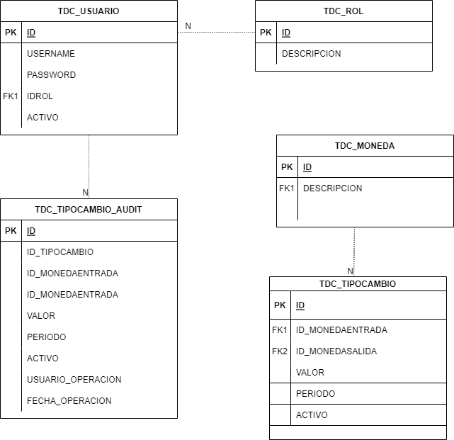

# Prueba Tecnica
## 1.- Problema
El sistema debe poder realizar un tipo de cambio a un monto donde se deben utilizar el monto, moneda de origen, moneda de destino, monto con el tipo de campo y el tipo de cambio
Debe Permitir el registro, actualización y búsqueda del tipo de cambio
Debe tener una autenticación
Por cada tipo de cambio realizado, se debe registrar quien hizo la solicitud (auditoría funcional)

## 2.- Solucion

### Diagrama de Entidad - Relacion
